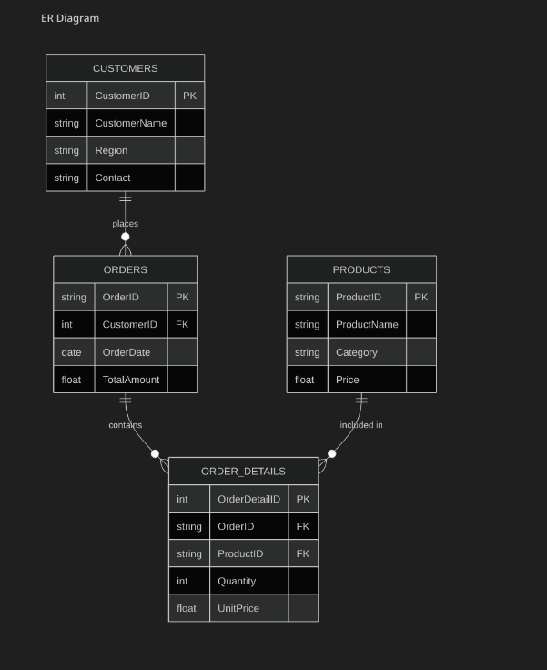

# Retail Sales Database

## Overview
This project implements a normalized relational database for retail sales analysis using the Amazon Sales Dataset. The database is designed in Third Normal Form (3NF) and includes SQL queries for comprehensive sales analysis.

## Database Schema
The database is normalized to 3NF and consists of the following tables:
- **Customers**: Stores customer information (synthetically generated for this dataset).
- **Products**: Stores unique product details extracted from SKUs.
- **Orders**: Stores order metadata including dates and totals.
- **OrderDetails**: Stores line items for each order with quantities and prices.


### ER Diagram




```mermaid

ErDiagram
    Customers ||--o{ Orders : places
    Orders ||--o{ OrderDetails : contains
    Products ||--o{ OrderDetails : "included in"

    Customers {
        INTEGER CustomerID PK
        TEXT CustomerName
        TEXT Region
        TEXT Contact
    }

    Orders {
        TEXT OrderID PK
        INTEGER CustomerID FK
        DATE OrderDate
        REAL TotalAmount
    }

    OrderDetails {
        INTEGER OrderDetailID PK
        TEXT OrderID FK
        TEXT ProductID FK
        INTEGER Quantity
        REAL UnitPrice
    }

    Products {
        TEXT ProductID PK
        TEXT ProductName
        TEXT Category
        REAL Price
    }
```

## Project Structure
```
blend-assignment-2/
├── dataset/
│   └── Amazon Sale Report.csv
├── schema.sql              # Database schema definition
├── import_data.py          # Data import and transformation script
├── queries.sql             # Analysis queries
├── retail_sales.db         # SQLite database file
└── README.md              # This file
```

## Implementation Details
- **Database**: SQLite (`retail_sales.db`)
- **Data Source**: [Amazon Sale Report.csv](file:///home/hrsflex/blend-assignment-2/dataset/Amazon%20Sale%20Report.csv)
- **Import Script**: [import_data.py](file:///home/hrsflex/blend-assignment-2/import_data.py)
  - Handles data cleaning and validation
  - Generates synthetic customer data
  - Maps orders to customers
  - Extracts unique products from SKUs
- **Schema**: [schema.sql](file:///home/hrsflex/blend-assignment-2/schema.sql)
- **Queries**: [queries.sql](file:///home/hrsflex/blend-assignment-2/queries.sql)

## Features
### Data Processing
- **Data Cleaning**: Handles missing values, duplicates, and data type conversions
- **Customer Generation**: Creates synthetic customer records with regional distribution
- **Product Extraction**: Extracts unique products from SKU data
- **Order Aggregation**: Calculates total amounts per order

### Analysis Queries
1. **Top-selling product by month**: Identifies best-performing products over time
2. **Sales by region**: Analyzes regional sales performance using JOINs and GROUP BY
3. **High-value customers**: Identifies customers with total spend > 1000

## Query Results

### 1. Top-selling product by month
(Snippet of top results)
```text
Month    ProductName  TotalQuantity
-------  -----------  -------------
2022-06  JNE3797      340          
2022-06  JNE3797      263          
2022-04  JNE3797      258          
...
```

### 2. Sales by region
```text
Region           TotalSales
---------------  ----------
MAHARASHTRA      13340333.05
KARNATAKA        10480694.29
TELANGANA        6915018.18
UTTAR PRADESH    6823947.08
TAMIL NADU       6519182.3
DELHI            4235215.28
KERALA           3808542.08
WEST BENGAL      3507707.84
ANDHRA PRADESH   3219859.93
HARYANA          2880902.77
...
```

### 3. High-value Customers (> 1000)
(Snippet of customers with total spend > 1000)
```text
CustomerID  CustomerName     Region       TotalSpend
----------  ---------------  -----------  ----------
2655        Customer_2655    MAHARASHTRA  12423.0   
19873       Customer_19873   MAHARASHTRA  10077.0   
33160       Customer_33160   MAHARASHTRA  9518.0    
16462       Customer_16462   MAHARASHTRA  9392.0    
29805       Customer_29805   MAHARASHTRA  9163.0    
...
```

## How to Run

### Prerequisites
- Python 3.x
- pandas library
- SQLite3

### Installation
```bash
pip install pandas
```

### Setup and Execution

1. **Create Database Schema**:
   ```bash
   sqlite3 retail_sales.db < schema.sql
   ```

2. **Import Data**:
   ```bash
   python3 import_data.py
   ```
   This will:
   - Read the CSV file
   - Clean and transform the data
   - Generate synthetic customers
   - Populate all tables

3. **Run Analysis Queries**:
   ```bash
   sqlite3 -header -column retail_sales.db < queries.sql
   ```

4. **Interactive Database Access**:
   ```bash
   sqlite3 retail_sales.db
   ```

## Technical Details

### Database Normalization
The schema follows Third Normal Form (3NF):
- **1NF**: All attributes contain atomic values
- **2NF**: No partial dependencies on composite keys
- **3NF**: No transitive dependencies

### Data Transformations
- Date parsing and validation
- Numeric type conversions with error handling
- Duplicate removal
- NULL value handling
- Regional data mapping

### Relationships
- One-to-Many: Customers → Orders
- One-to-Many: Orders → OrderDetails
- One-to-Many: Products → OrderDetails

## Notes
- Customer data is synthetically generated as the original dataset doesn't include customer information
- Approximately 1 customer is created per 3 orders to simulate repeat business
- Product prices are extracted from the Amount field in the CSV
- Regional data is mapped from the ship-state field to customer regions

## License
This project is for educational purposes. made by Harsh Kumar

